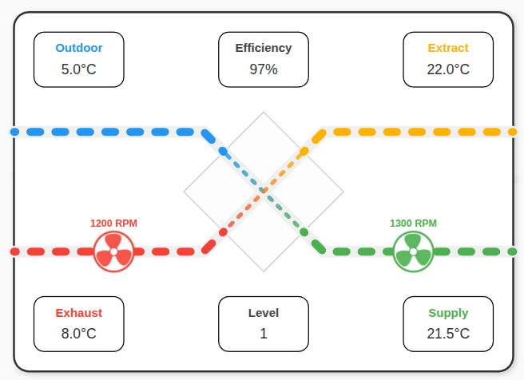
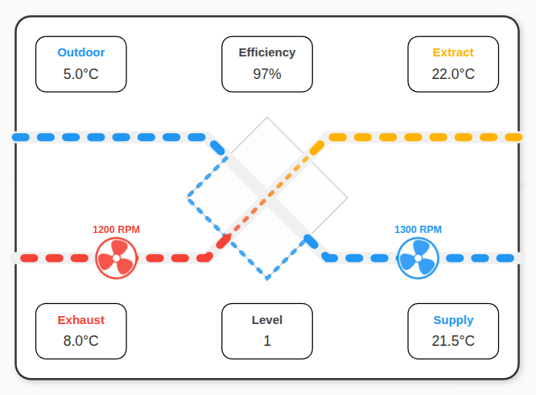

# Home Assistant Airflow Card

Eine benutzerdefinierte Lovelace-Karte zur Visualisierung von Lüftungsanlagen (Airflow).

## Visualisierung

|               Normalbetrieb                |                        Aktiver Bypass                         |
| :----------------------------------------: | :-----------------------------------------------------------: |
|  |        |
|       *Standard-Wärmetauschermodus*        | *Bypass aktiv: Außenluft wird am Wärmetauscher vorbeigeführt* |

## Terminologie

Die folgenden Standardbegriffe werden für die Luftwege verwendet:

| Begriff       | Englisch    | Beschreibung                    | Pfad                          |
| ------------- | ----------- | ------------------------------- | ----------------------------- |
| **Außenluft** | Outdoor Air | Frische Luft von draußen        | Außen (Oben Links) -> Gerät   |
| **Zuluft**    | Supply Air  | Frische Luft für die Räume      | Gerät -> Räume (Unten Rechts) |
| **Abluft**    | Extract Air | Verbrauchte Luft aus den Räumen | Räume (Oben Rechts) -> Gerät  |
| **Fortluft**  | Exhaust Air | Verbrauchte Luft nach draußen   | Gerät -> Außen (Unten Links)  |

## Funktionen
- **Dynamische Visualisierung:** Animiert Luftströme und Lüfter basierend auf Live-Daten.
- **Sprachunterstützung:** Integrierte Unterstützung für Deutsch und Englisch.
- **Dynamische Geschwindigkeit:** Luftstrom- und Lüftergeschwindigkeit passen sich der aktuellen Lüfterstufe an.
- **Effizienzberechnung:** Option zur Live-Berechnung des Wirkungsgrads aus den Temperatursensoren.
- **Bypass-Logik:** Visuelle Umleitung des Außenluftstroms bei aktivem Bypass inklusive Farbanpassung.
- **Anpassbare Farben:** Vollständig konfigurierbare Farben für alle vier Luftwege.
- **UI-Editor:** Einfache Konfiguration über den Home Assistant Karten-Editor.

## Konfiguration

Die Karte kann vollständig über den visuellen Editor konfiguriert werden.

### Erforderliche Entitäten
- **Zuluft Temp:** Temperatur der Luft, die in die Räume geleitet wird.
- **Abluft Temp:** Temperatur der verbrauchten Luft aus den Räumen.
- **Fortluft Temp:** Temperatur der Luft, die nach draußen geblasen wird.
- **Außenluft Temp:** Temperatur der frischen Luft von draußen.

### Optionale Entitäten & Einstellungen
- **Zu-/Abluftventilator:** RPM-Sensoren für die Motoren. Werte > 0 lösen die Animation aus.
- **Effizienz Sensor:** Bestehender Sensor für den Wirkungsgrad des Wärmetauschers (%).
- **Dynamische Effizienzberechnung:** Falls aktiviert, berechnet die Karte den Wert selbst: `(Zuluft - Außenluft) / (Abluft - Außenluft) * 100`.
- **Lüfterstufe Sensor:** Sensor für die aktuelle Betriebsstufe (z. B. 1, 2, 3).
- **Min/Max Stufe:** Bereich deiner Lüfterstufen zur Skalierung der Animationsgeschwindigkeit.
- **Bypass Entität:** Binärer Sensor oder Sensor, der anzeigt, ob der Bypass aktiv ist.
- **Sprache:** Auswahl zwischen Deutsch und Englisch.
- **Farben:** Eigene Hex-Codes für Außenluft, Zuluft, Abluft und Fortluft.

## Installation

### Manuell
1. Kopiere `dist/homeassistant-airflow-card.js` in deinen Home Assistant `www` Ordner.
2. Füge die Ressource in deinem Lovelace Dashboard hinzu:
   - URL: `/local/homeassistant-airflow-card.js`
   - Typ: `Module`

## Entwicklung

1. Führe `npm install` aus.
2. Führe `npm run dev` aus, um den lokalen Entwicklungsserver zu starten (`index.html`).
3. Führe `npm run build` aus, um die Dist-Datei zu erstellen.
