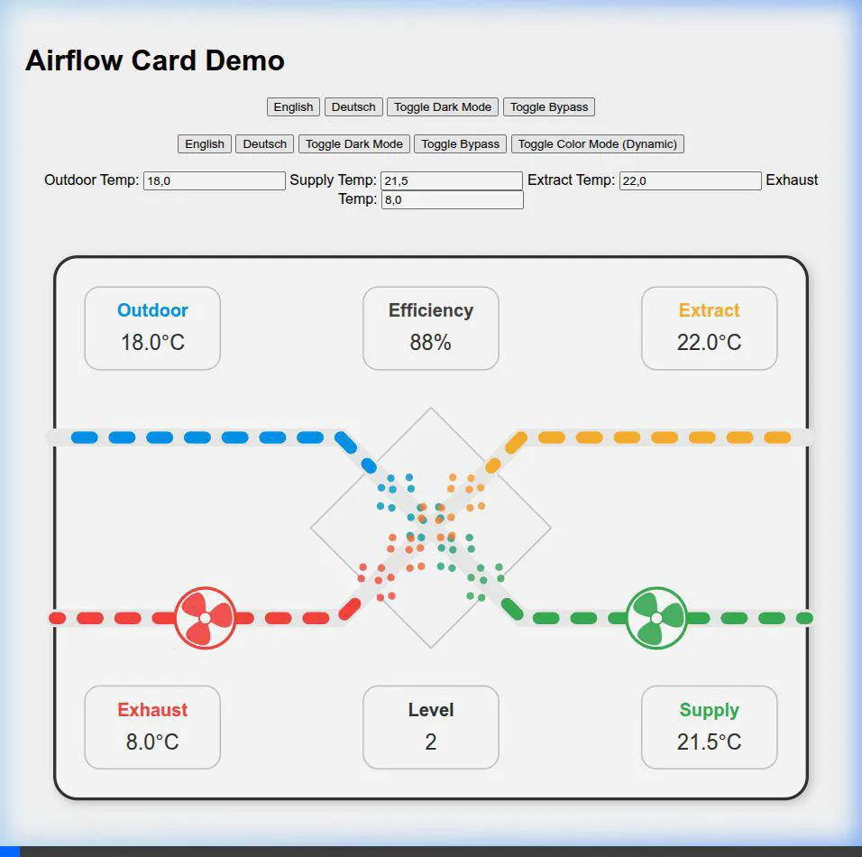
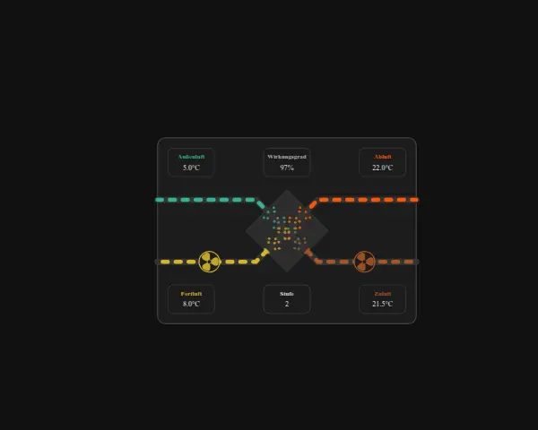
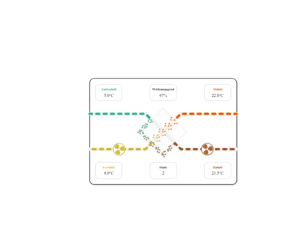
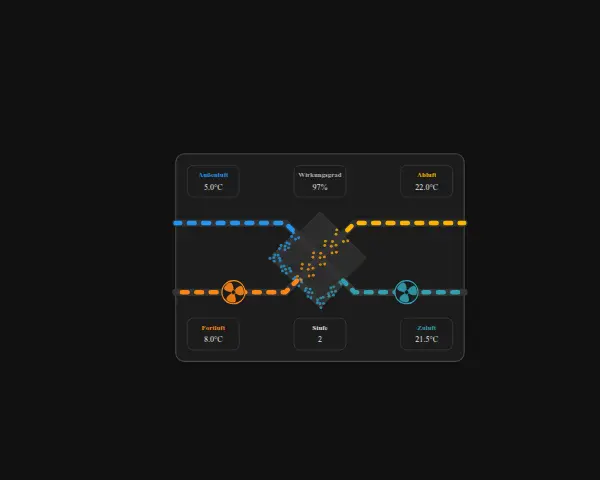

# Home Assistant Airflow Card

A custom Lovelace card to visualize ventilation systems (Airflow).

## Visualization

| Light Mode (Static Colors) | Dark Mode (Dynamic Colors) |
| :-------------------------------------------: | :----------------------------------------------------------: |
|  *Standard heat exchange mode* |  *Colors naturally follow the air temperatures* |
|  *Bypass active: Colors follow unexchanged temps* |  *Bypass active (Dark Mode / Static Colors)* |

## Airflow Terminology

The following standard terminology is used for the air paths:

| Term            | German    | Description                 | Path                          |
| --------------- | --------- | --------------------------- | ----------------------------- |
| **Outdoor Air** | Außenluft | Fresh air from outside      | Outside (Top Left) -> Unit    |
| **Supply Air**  | Zuluft    | Fresh air supplied to rooms | Unit -> Rooms (Bottom Right)  |
| **Extract Air** | Abluft    | Stale used air from rooms   | Rooms (Top Right) -> Unit     |
| **Exhaust Air** | Fortluft  | Stale air blown outside     | Unit -> Outside (Bottom Left) |

## Features
- **Particle Animation:** Dynamic particle swarm within the heat exchanger that vividly visualizes airflows.
- **Color Morphing:** Smooth color transition of particles during heat exchange (e.g., from cold blue to fresh green).
- **Dynamic Visualization:** Animates airflow and fans based on live data using robust SVG animations.
- **Language Support:** Built-in English and German support.
- **Dynamic Animation Speed:** Airflow and fan speeds adjust based on the current ventilation level. Works automatically even if no RPM sensors are available.
- **Efficiency Calculation:** Option to calculate heat exchanger efficiency live from temperature sensors.
- **Bypass Logic:** Airflow paths are visually diverted when the bypass is active. Colors dynamically reflect the unexchanged temperatures if `color_mode` is set to `dynamic_temp`.
- **Theme & Dark Mode Support:** Automatically adapts to Home Assistant's themes. Supports explicit "Auto", "Dark", and "Light" modes via configuration.
- **Customizable Colors:** Fully adjustable colors for all four airflow paths via a selection menu.
- **UI Editor:** Easy configuration via the Home Assistant card editor.

## Configuration

The card can be fully configured via the Visual Editor.

### Required Entities
- **Supply Temp:** Temperature of the air being supplied to the rooms.
- **Extract Temp:** Temperature of the stale air coming from the rooms.
- **Exhaust Temp:** Temperature of the air being blown outside.
- **Outdoor Temp:** Temperature of the fresh air from outside.

### Optional Entities & Settings
- **Supply/Extract Fan:** Sensors for the motors (e.g., RPM or state). If 0 or off, the fan icon remains static unless a **Fan Level** > 0 is detected.
- **Efficiency Sensor:** Existing sensor for heat exchanger efficiency (%).
- **Dynamic Efficiency Calculation:** If enabled, the card calculates efficiency using: `(Supply - Outdoor) / (Extract - Outdoor) * 100`.
- **Fan Level Sensor:** Sensor for the current operational stage (e.g., 1, 2, 3). This sensor now also controls the animation if no RPM sensors are configured.
- **Min/Max Level:** Define the range of your ventilation stages to scale the animation speed.
- **Bypass Entity:** Binary sensor or sensor that indicates if the bypass is active.
- **Background Color Mode:** Select between "Automatic (Theme)", "Fixed Dark", and "Fixed Light".
- **Color Mode (`color_mode`):** `static` (default) or `dynamic_temp`. In `dynamic_temp` mode, the base colors are continuously modulated by the air temperature (mixed with red for hot, blue for cold).
- **Static Colors:** Custom hex-codes for Outdoor, Supply, Extract, and Exhaust paths.
- **Dynamic Temp Colors:** `base_color_supply`, `base_color_exhaust`. 
- **Dynamic Temp Settings:** `temp_min` (-2.5), `temp_max` (32.5), `temp_neutral` (10), `color_hot` (#FF0000), `color_cold` (#00BFFF).

### Theme Mode
The card supports three appearance modes:
- **Automatic (default):** Uses CSS variables from your Home Assistant theme.
- **Fixed Dark:** Forces dark background and light text, ideal for specific dashboard designs.
- **Fixed Light:** Forces white background and dark text.

## Installation

### Manual
1. Copy `dist/homeassistant-airflow-card.js` to your Home Assistant `www` folder.
2. Add the resource in your Lovelace Dashboard resources:
   - URL: `/local/homeassistant-airflow-card.js`
   - Type: `Module`

## Development

1. Run `npm install`
2. Run `npm run dev` to start a local development server (`index.html`).
3. Run `npm run build` to build the distribution file.
